# Hamster Detect | 智能倉鼠手勢互動系統

[](https://vite.dev/)
[](https://developers.google.com/mediapipe)
[](https://pages.github.com/)

這是一個結合前沿 **AI 邊緣端視覺 (Edge AI)** 與 **現代響應式前端美學** 的互動式手勢辨識網頁系統。透過鏡頭捕捉使用者的手部動作，即時分析三維關節特徵，並將其智能對應至 12 種最具代表性的可愛倉鼠迷因影像！

---

## 核心技術亮點 (Technical Highlights)

* **邊緣端高效推理**：基於 `Google MediaPipe Tasks Vision API (v0.10.0)` 進行高效能、低延遲的 21 節點手部 3D 骨架追蹤，完全於瀏覽器端執行，確保絕佳隱私。
* **3D 空間向量夾角演算法**：突破傳統 2D 距離法易受「手部傾斜、前後深度變化」干擾的瓶頸，全面改用 **3D 關節向量內積法**。即使手指朝向相機鏡頭深度方向彎曲，亦能精確捕捉。
* **鏡像校正外積判定**：利用雙向量外積 (Cross Product) 演算法，並完美融合前置鏡頭鏡像特性與 `handednesses` 分類，實現 100% 精準的手心 (Palm) 與手背 (Back) 面向判定。
* **時域穩定濾波 (Stable Frames Filter)**：引進 `STABLE_FRAMES` 窗格穩定機制，有效消除高頻手部顫抖或暫態誤判，帶來極致流暢、不跳變的影像切換體驗。
* **極致現代 Glassmorphism 響應式 UI**：
  * **電腦端**：左側固定寬度 (240px) 側邊雙面板，將視訊主體完美居中，黑框與倉鼠顯示框左右同寬、極具視覺張力。
  * **行動端**：底部 50/50 寬度完美並排，倉鼠框採用「上圖下文」高垂直佈局對齊黑框高度，確保小螢幕下完全不重疊、不遮擋核心偵測畫面。

---

## 📊 系統架構與資料流 (System Architecture)

以下為本專案手勢偵測、特徵抽取與 UI 渲染的核心工作流：

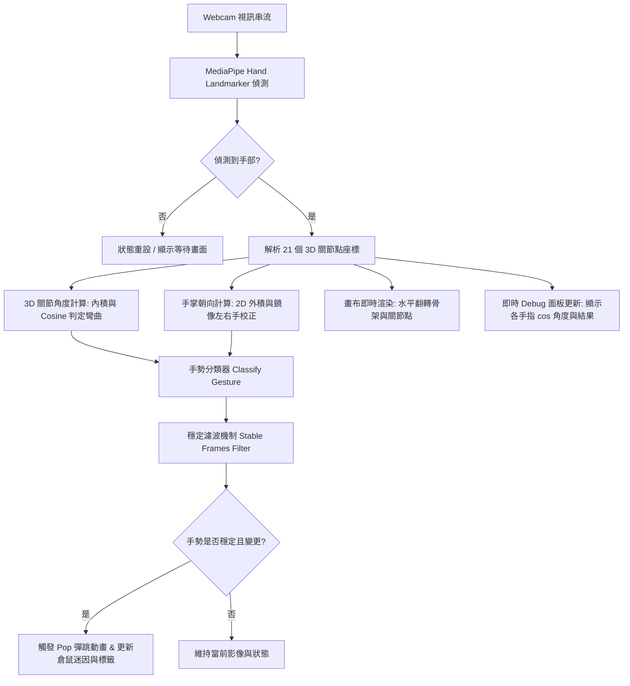

---

## 核心算法與數學原理 (Algorithm & Mathematics)

### 1. 3D 關節角度計算（3D 空間向量內積法）

傳統的手指伸直判斷通常採用「指尖至手掌中心的 2D 歐氏距離」，此法在手部向相機傾斜時會產生極大誤差。本系統採用 **3D 向量夾角餘弦值 ($\cos \theta$)** 作為判定依據。

對於任一手指關節節點 $b$（例如 PIP 關節），其前驅節點為 $a$，後繼節點為 $c$。我們在 3D 空間中建立兩個向量：
$$\vec{v}_1 = \vec{ab} = (x_a - x_b, \, y_a - y_b, \, z_a - z_b)$$
$$\vec{v}_2 = \vec{cb} = (x_c - x_b, \, y_c - y_b, \, z_c - z_b)$$

這兩個 3D 空間向量的夾角餘弦值 $\cos \theta$ 公式為：
$$\cos \theta = \frac{\vec{v}_1 \cdot \vec{v}_2}{\|\vec{v}_1\| \|\vec{v}_2\|} = \frac{v_{1x}v_{2x} + v_{1y}v_{2y} + v_{1z}v_{2z}}{\sqrt{v_{1x}^2 + v_{1y}^2 + v_{1z}^2} \sqrt{v_{2x}^2 + v_{2y}^2 + v_{2z}^2}}$$

> [!NOTE]
> * 當 $\cos \theta \to -1$（即 $\theta \to 180^\circ$）時，表示關節完全伸直。
> * 當 $\cos \theta \ge 0$（即 $\theta \le 90^\circ$）時，表示關節處於彎曲狀態。
> * **判定標準**：系統內建當 **PIP（第一指節）的 $\cos < -0.5$** 且 **DIP（第二指節）的 $\cos < 0$** 時，該手指判定為伸直 (`Up`)。

---

### 2. 手心 / 手背面向判定（2D 向量外積與鏡像校正）

為了判別手掌面對鏡頭的是手心還是手背，我們選取了三個特徵點：**手腕 Wrist (0)**、**食指根部 Index MCP (5)**、**小指根部 Pinky MCP (17)**。

定義 2D 向量：
$$\vec{v}_1 = \vec{WI} = (x_I - x_W, \, y_I - y_W)$$
$$\vec{v}_2 = \vec{WP} = (x_P - x_W, \, y_P - y_W)$$

計算兩向量的 2D 外積 (Cross Product) 標量 $C$：
$$C = v_{1x}v_{2y} - v_{1y}v_{2x}$$

> [!IMPORTANT]
> **前置鏡頭鏡像修正**：
> 由於瀏覽器前置鏡頭畫面水平翻轉，MediaPipe 回傳的左右手分類 (`handednesses`) 會將畫面中實際的右手辨識為 `Left`，左手辨識為 `Right`。
> 為了修正此一鏡像效應，本系統實作了以下轉換邏輯：
> * 當 `handedness === 'Left'` (畫面上實際的右手) 時：若 $C < 0$，則為 **手心 (Palm)**；若 $C > 0$，則為 **手背 (Back)**。
> * 當 `handedness === 'Right'` (畫面上實際的左手) 時：若 $C > 0$，則為 **手心 (Palm)**；若 $C < 0$，則為 **手背 (Back)**。

---

## 🎛️ 1 對 1 精準手勢對應表 (Gesture Mapping Table)

本專案經過精密調校，確保 **12 種獨特手勢** 與 **12 張倉鼠互動圖片** 達成完美的一對一對應，無任何重疊衝突：

### 👐 雙手手勢 (Double Hands Gestures)

| 手勢代號 | 判定條件 (Criteria) | 對應倉鼠迷因影像 | UI 提示標籤 |
| :--- | :--- | :---: | :--- |
| `double_victory` | 雙手皆只有**食指**與**中指**伸直 | 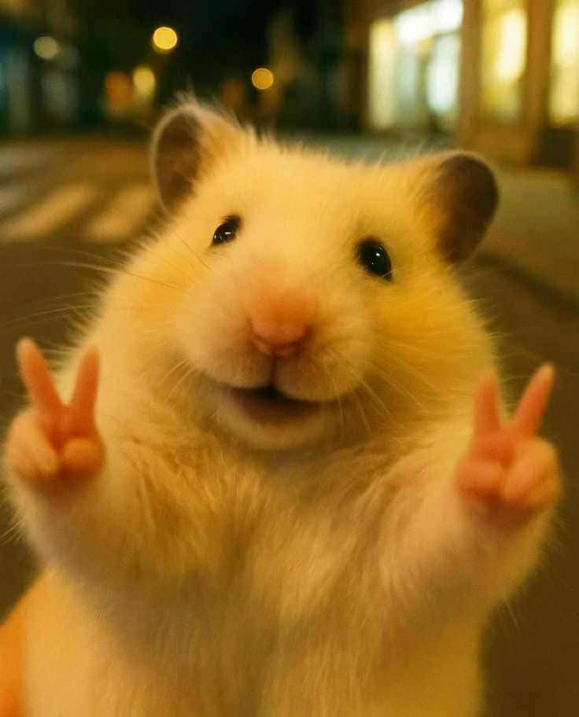{width=60} | `✌️✌️ 你是棒倉鼠` |
| `double_thumbsup` | 雙手皆**拇指**伸直，且每隻手伸直手指數 $\le 2$ | 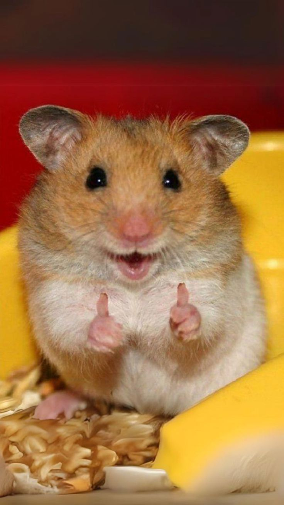{width=60} | `👍👍 倉鼠歡呼！` |
| `double_open` | 雙手皆有 $\ge 4$ 根手指伸直 | 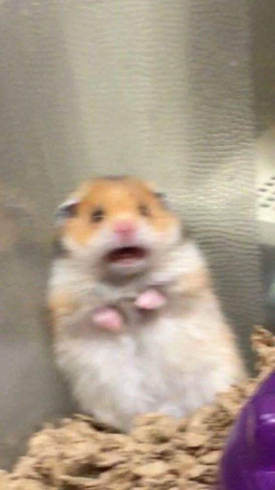{width=60} | `🖐️🖐️ 倉鼠嚇到！` |
| `double_fist` | 雙手伸直的手指數量皆為 $0$ | 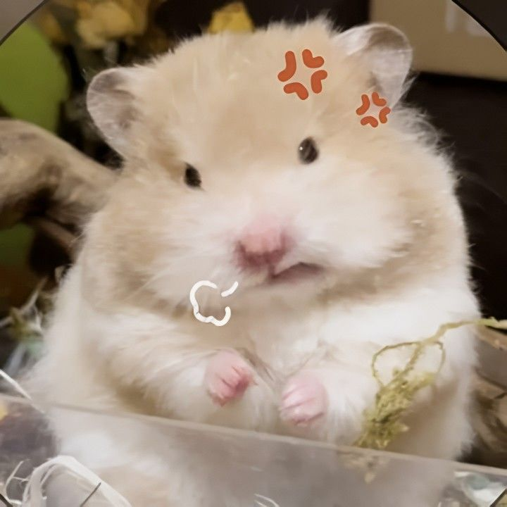{width=60} | `✊✊ 倉鼠生氣！` |
| `two_hands_sides` | 雙手同時出現，且**一隻手為手心、另一隻手為手背** | 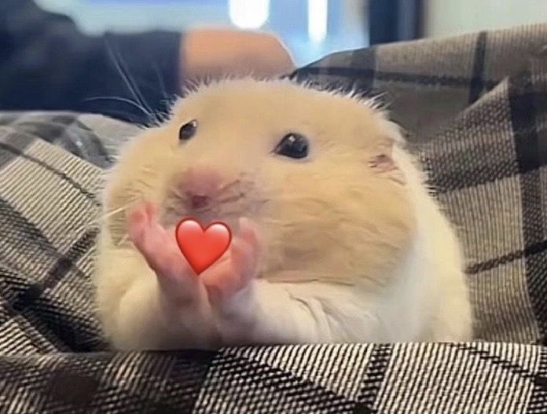{width=60} | `🤲 倉鼠的愛！` |

### ✋ 單手手勢 (Single Hand Gestures)

| 手勢代號 | 判定條件 (Criteria) | 對應倉鼠迷因影像 | UI 提示標籤 |
| :--- | :--- | :---: | :--- |
| `thumbsup` | **僅拇指**伸直，其餘四指必須全部彎曲 | 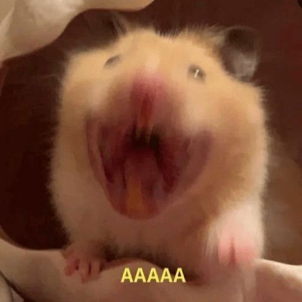{width=60} | `👍 開心倉鼠！` |
| `victory` | **食指**與**中指**伸直，其餘手指皆彎曲 | 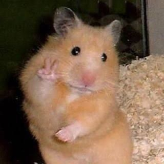{width=60} | `✌️ 倉鼠手收！` |
| `pointing` | **僅食指**伸直，其餘四指皆彎曲 | 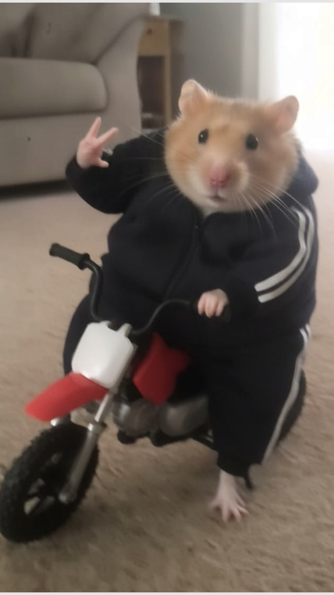{width=60} | `☝️ 酷倉鼠！` |
| `open_palm` | 伸直手指 $\ge 4$ 根，且手掌判定為 **手心** | 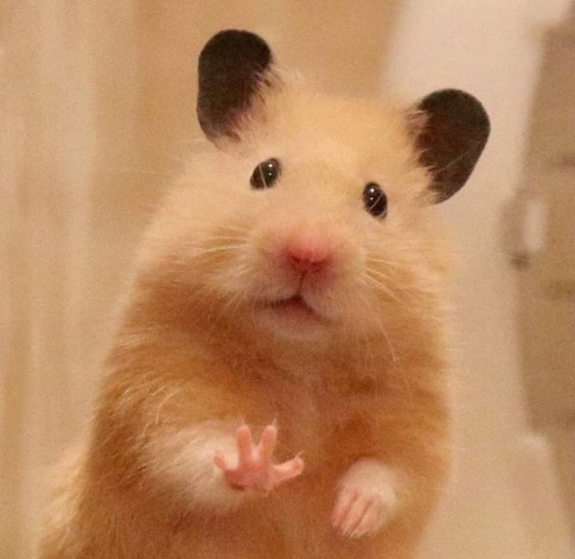{width=60} | `🖐️ 倉鼠嗨！` |
| `open_back` | 伸直手指 $\ge 4$ 根，且手掌判定為 **手背** | 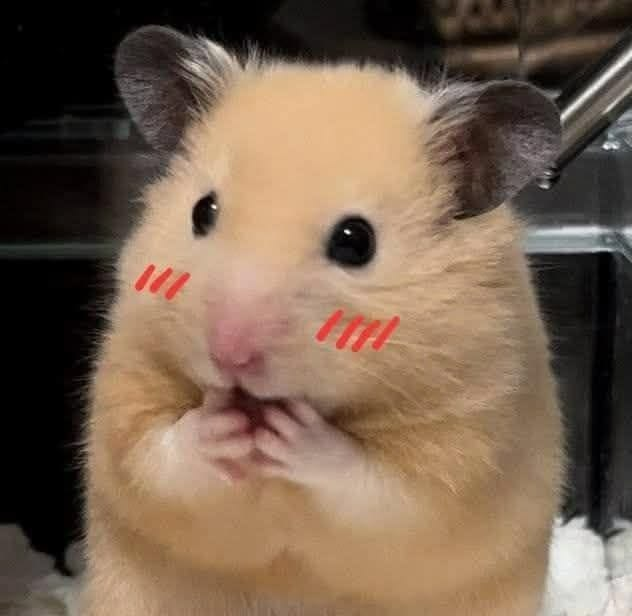{width=60} | `🫲 倉鼠害羞！` |
| `fist` | 伸直手指數量為 $0$ (握拳) | {width=60} | `✊ 料理鼠王！` |
| `three` | 任意剛好有 $3$ 根手指伸直 | 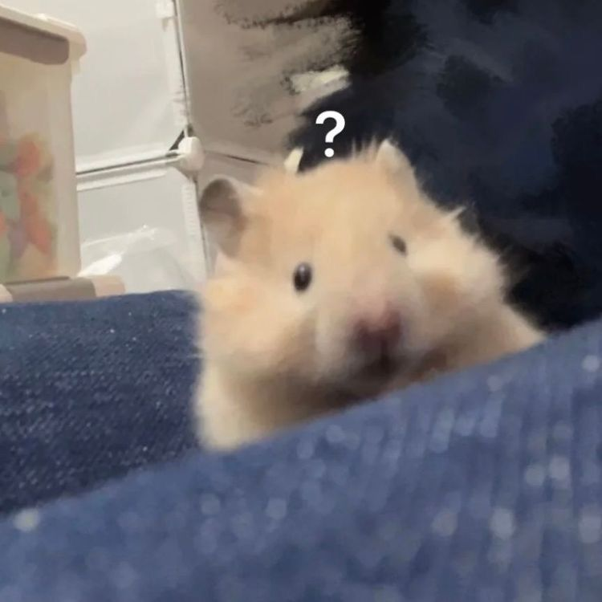{width=60} | `🤔 倉鼠困惑！` |

*註：若畫面中出現未定義的單手手勢，系統將顯示 `unknown` 並對應至 `🤔 倉鼠困惑...` 影像。*

---

## 開發環境與本地端運行 (Local Development)

本專案採用極速的前端建構工具 **Vite** 進行開發與打包。

### 先決條件
* 已安裝 [Node.js](https://nodejs.org/) (建議版本 v18 或 v20 以上)。

### 1. 複製專案與安裝依賴
```bash
git clone https://github.com/HungTaWang/Hamster_Detect
cd Hamster_Detect
npm install
```

### 2. 啟動本地開發伺服器
```bash
npm run dev
```
啟動後，在瀏覽器打開 `http://localhost:5173/`。由於 MediaPipe 需使用 Camera，瀏覽器會跳出相機授權請求，請點擊 **允許**。

### 3. 專案打包與生產端預覽
```bash
# 進行生產環境編譯打包，輸出至 dist 資料夾
npm run build

# 本地預覽生產環境編譯後的靜態網頁
npm run preview
```
